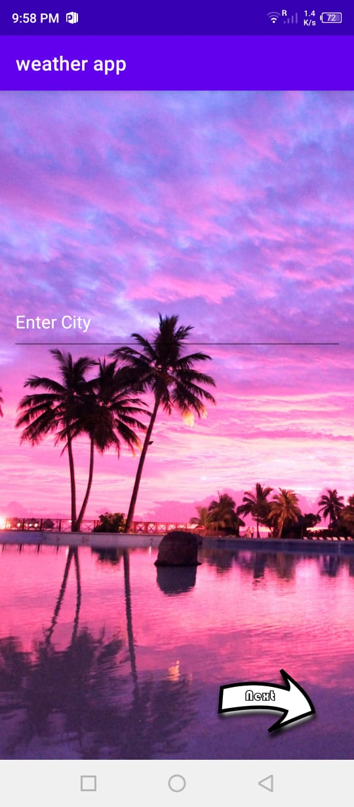
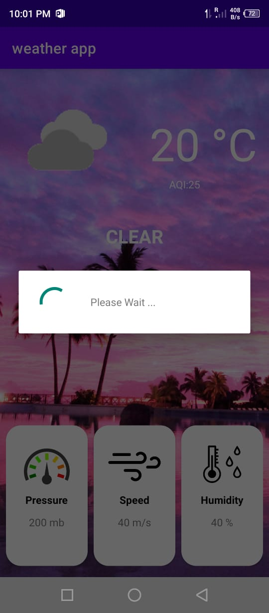
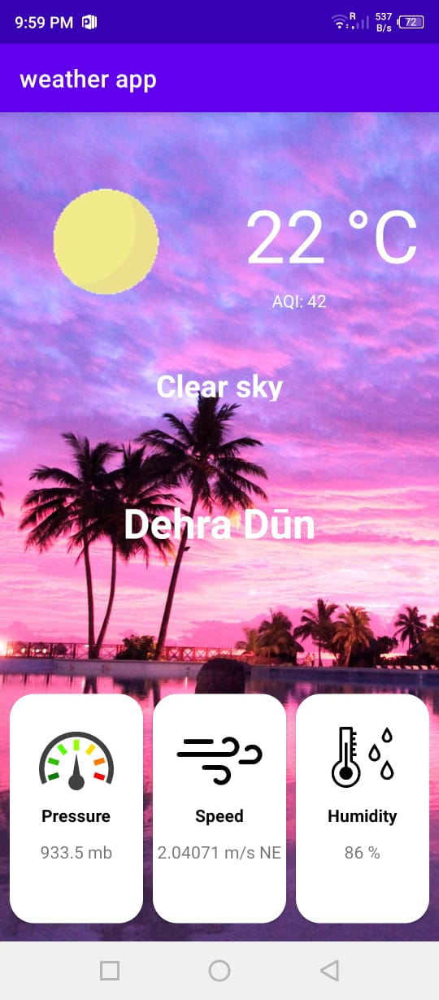
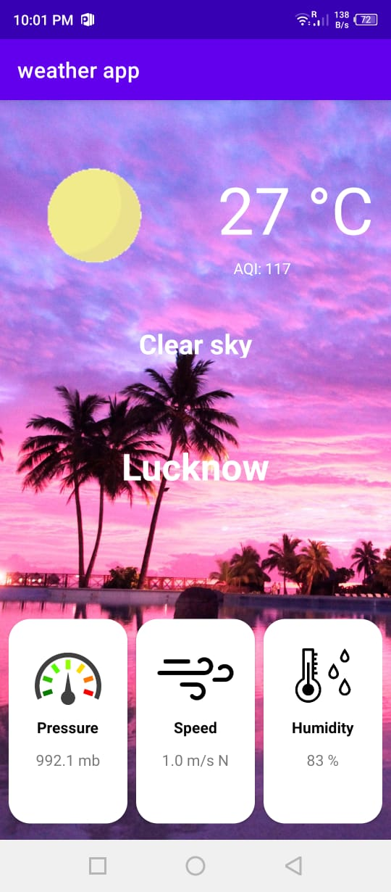

# weatherapp

- IDE used: Android Studio

- API used: [weather bit](https://www.weatherbit.io/)

<!-- video link -->
- Video Link => [click here](https://youtu.be/alD0hfXQEm4) 

## Screenshots 
<!-- image link -->

    
    
    
    

## Video

https://user-images.githubusercontent.com/39018215/135761997-c7a793a4-399a-4825-b781-6b526744ba82.mp4
